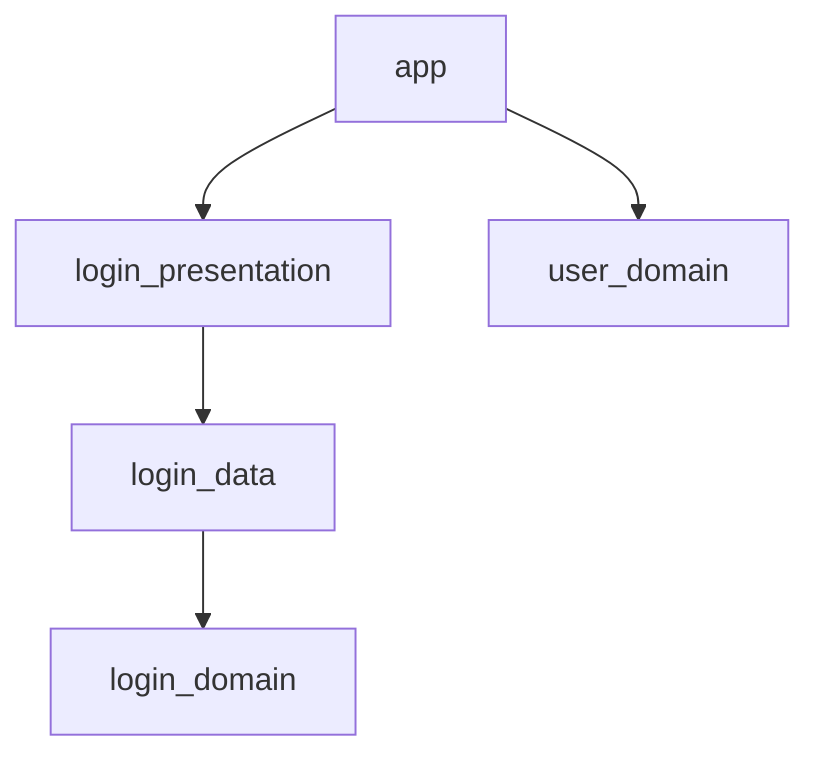

<div align="center">


**A Flutter project management framework inspired by Tuist**

[](pubspec.yaml)
[](https://dart.dev)

</div>

## 📋 Table of Contents

- [About](#-about)
- [Installation](#-installation)
- [Features](#-features)
- [Quick Start](#-quick-start)
- [Commands](#-commands)
  - [init](#init)
  - [create](#create)
  - [generate](#generate)
  - [pub](#pub)
  - [scaffold](#scaffold)
  - [graph](#graph)
  - [help](#help)
- [Project Structure](#-project-structure)
- [Configuration Files](#-configuration-files)
  - [project.dart](#projectdart)
  - [package.dart](#packagedart)
  - [pubspec.yaml](#pubspecyaml)
- [Module Types](#-module-types)
- [Scaffold Templates](#-scaffold-templates)
- [Dependency Management](#-dependency-management)
- [Code Generation](#-code-generation)
- [Examples](#-examples)
- [Contributing](#-contributing)
- [License](#-license)

## 🎯 About

Flutist is a powerful project management framework for Flutter applications, inspired by [Tuist](https://tuist.io) for iOS development. It provides a structured approach to managing large-scale Flutter projects with modular architecture, centralized dependency management, and code generation capabilities.

## 🚀 Core Commands

The main commands you'll use most frequently:

### `flutist init`
Initialize a new Flutist project with workspace support. Creates all configuration files and sets up the project structure.

### `flutist create`
Create new modules (feature, library, standard, simple) with predefined architectures.

### `flutist generate`
Sync all `pubspec.yaml` files based on `project.dart` and regenerate `flutist_gen.dart`.

### `flutist scaffold`
Generate code from user-defined templates. Create boilerplate code quickly with custom templates.

---

## 📋 All Commands

| Command | Description | Usage |
|---------|-------------|-------|
| **`init`** | Initialize a new Flutist project | `flutist init` |
| **`create`** | Create a new module | `flutist create --path <path> --name <name> --options <type>` |
| **`generate`** | Sync dependencies and regenerate files | `flutist generate` |
| **`scaffold`** | Generate code from templates | `flutist scaffold <template> --name <name>` |
| **`pub`** | Manage dependencies | `flutist pub add <package>` |
| **`graph`** | Visualize module dependencies | `flutist graph [--format <format>]` |
| **`help`** | Show help information | `flutist help [command]` |

For detailed information about each command, see the [Commands](#-commands) section below.

---

## 📦 Installation

### Prerequisites

- Dart SDK (>=3.5.0 <4.0.0)

### Install Flutist

```bash
dart pub global activate flutist
```

### Why Flutist?

- **🏗️ Modular Architecture**: Organize your codebase into clear, reusable modules
- **📦 Centralized Dependencies**: Manage all dependencies in one place
- **🚀 Fast Development**: Generate boilerplate code with scaffold templates
- **🔗 Dependency Visualization**: Visualize module dependencies with graphs
- **⚡ Workspace Support**: Leverage Flutter's native workspace feature
- **🎨 Code Generation**: Create custom templates for rapid development

## ✨ Features

- **Workspace Management**: Native Flutter workspace support for multi-package projects
- **Module Creation**: Create modules with predefined structures (feature, library, standard, simple)
- **Dependency Sync**: Automatically sync dependencies across all modules
- **Code Scaffolding**: Generate code from custom templates
- **Dependency Graphs**: Visualize module dependencies in multiple formats
- **Type-Safe Configuration**: Dart-based configuration files with IDE support
- **Code Generation**: Auto-generate helper code for easy dependency access

## 🚀 Quick Start

### 1. Initialize a New Project

```bash
# Navigate to your project directory
cd my_flutter_project

# Initialize Flutist
flutist init
```

This command will:
- Create `project.dart` and `package.dart` configuration files
- Set up `pubspec.yaml` with workspace configuration
- Create a default `app` module
- Generate example scaffold templates
- Create `flutist_gen.dart` for code generation

### 2. Create a Module

```bash
# Create a feature module
flutist create --path features --name login --options feature

# Create a simple module
flutist create --path lib --name utils --options simple
```

### 3. Sync Dependencies

```bash
# Add a dependency to package.dart
flutist pub add http

# Sync dependencies to all modules
flutist generate
```

### 4. Generate Code from Templates

```bash
# List available templates
flutist scaffold list

# Generate code from a template
flutist scaffold feature --name login
```

## 🛠️ Commands

Detailed documentation for all Flutist commands.

### `flutist init`

**Initialize a new Flutist project with Workspace support.**

**Usage:**
```bash
flutist init
```

**What it does:**
- Creates `project.dart` - Project configuration file
- Creates `package.dart` - Centralized dependency management
- Sets up `pubspec.yaml` - Workspace configuration
- Creates `analysis_options.yaml` - Linting rules
- Creates `README.md` - Project documentation
- Creates default `app` module
- Generates example scaffold templates in `flutist/templates/`
- Generates `flutist/flutist_gen.dart` - Code generation helpers

**Example:**
```bash
flutist init
```

**Generated Structure:**
```
my_project/
├── project.dart
├── package.dart
├── pubspec.yaml
├── analysis_options.yaml
├── README.md
├── lib/
│   └── main.dart
├── app/
│   ├── lib/
│   │   └── app.dart
│   └── pubspec.yaml
└── flutist/
    ├── templates/
    │   └── feature/
    │       ├── template.yaml
    │       ├── bloc.dart.template
    │       ├── state.dart.template
    │       ├── event.dart.template
    │       └── screen.dart.template
    └── flutist_gen.dart
```

### `flutist create`

**Create a new module in the Flutist project.**

**Usage:**
```bash
flutist create --path <path> --name <name> --options <type>
```

**Options:**
- `--path, -p <path>` - Directory path where the module will be created (required)
- `--name, -n <name>` - Name of the module (required)
- `--options, -o <type>` - Module type: `feature`, `library`, `standard`, `simple` (required)

**Module Types:**

1. **feature** - Feature module with 3-layer architecture:
   - `{name}_domain` - Domain layer (business logic)
   - `{name}_data` - Data layer (repositories, data sources)
   - `{name}_presentation` - Presentation layer (UI, state management)

2. **library** - Library module with 5-layer architecture:
   - `{name}_example` - Example usage and demos
   - `{name}_interface` - Public API and contracts
   - `{name}_implementation` - Core implementation
   - `{name}_testing` - Test utilities and mocks
   - `{name}_tests` - Unit and widget tests

3. **standard** - Standard module with 3-layer architecture:
   - `{name}_implementation` - Core functionality
   - `{name}_tests` - Unit and integration tests
   - `{name}_testing` - Test utilities and helpers

4. **simple** - Simple module with minimal structure:
   - `lib/` - Source code directory

**Examples:**
```bash
# Create a feature module
flutist create --path features --name login --options feature

# Create a library module
flutist create --path lib --name network --options library

# Create a standard module
flutist create --path core --name models --options standard

# Create a simple module
flutist create --path lib --name utils --options simple

# Using short flags
flutist create -p features -n authentication -o feature
```

**What it does:**
- Creates module directory structure based on type
- Generates `pubspec.yaml` for each layer
- Creates `lib/` folders
- Generates `analysis_options.yaml` that includes root config
- Updates root `pubspec.yaml` workspace
- Updates `project.dart` with new module entries
- Updates `package.dart` with new module entries
- Generates `README.md` for the module

### `flutist generate`

**Sync all `pubspec.yaml` files based on `project.dart`.**

**Usage:**
```bash
flutist generate
```

**What it does:**
- Parses `package.dart` to get all available dependencies
- Parses `project.dart` to get module configurations
- Updates each module's `pubspec.yaml` with correct dependencies
- Calculates relative paths for module dependencies
- Regenerates `flutist_gen.dart` with latest module and dependency information

**When to use:**
- After modifying `project.dart` or `package.dart`
- After adding new dependencies with `flutist pub add`
- After creating new modules
- When dependencies are out of sync

**Example:**
```bash
flutist generate
```

**Output:**
```
🔹 Starting Flutist generation...
✅ Parsed package.dart
  Dependencies: 5
  Modules: 3
✅ Generated flutist_gen.dart
✅ Parsed project.dart
  Modules: 3
🔹 Updating pubspec.yaml files...
✅ Updated app
✅ Updated login_domain
✅ Updated login_data
✅ Updated login_presentation
✅ Generation completed!
```

### `flutist pub`

Manage dependencies in `package.dart`.

**Usage:**
```bash
flutist pub add <package_name> [--version <version>]
```

**Subcommands:**
- `add <package>` - Add a new dependency to `package.dart`

**Options:**
- `--version <version>` - Specify package version (optional, defaults to latest)

**What it does:**
- Fetches the latest version of the package using `dart pub add`
- Adds the dependency to `package.dart`
- Regenerates `flutist_gen.dart` with the new dependency

**Examples:**
```bash
# Add a package (auto-detects latest version)
flutist pub add http

# Add a package with specific version
flutist pub add provider --version ^2.0.0

# Add multiple packages
flutist pub add dio
flutist pub add bloc
flutist pub add flutter_bloc
```

**After adding dependencies:**
```bash
# Sync dependencies to all modules
flutist generate
```

### `flutist scaffold`

**Generate code from user-defined templates.**

**Usage:**
```bash
flutist scaffold <template> --name <name> [options]
flutist scaffold list
flutist scaffold help [subcommand]
```

**Subcommands:**
- `list` - Lists all available scaffold templates
- `help <subcommand>` - Show help for a specific subcommand

**Options:**
- `--name <name>` - Name for the generated files (required)
- `--path <path>` - Output path (default: current directory)
- `-h, --help` - Show help information

**Template Structure:**
```
flutist/templates/
  feature/
    template.yaml         # Template configuration
    bloc.dart.template    # Template file with {{name}} variables
    state.dart.template
    event.dart.template
    screen.dart.template
```

**Template Variables:**
- `{{name}}` - snake_case (e.g., `user_profile`)
- `{{Name}}` - PascalCase (e.g., `UserProfile`)
- `{{NAME}}` - UPPER_CASE (e.g., `USER_PROFILE`)
- `{{custom}}` - Custom attributes from `template.yaml`

**Examples:**
```bash
# List available templates
flutist scaffold list

# Generate from template
flutist scaffold feature --name login

# Generate with custom path
flutist scaffold feature --name user_profile --path lib/features

# Generate with custom attributes
flutist scaffold feature --name auth --basePath lib/features
```

**Template Configuration (`template.yaml`):**
```yaml
description: "Feature template with BLoC pattern"
attributes:
  - name: name
    required: true
  - name: path
    required: false
    default: "lib/features"
items:
  - type: file
    path: "{{path}}/{{name}}/{{name}}_bloc.dart"
    templatePath: "bloc.dart.template"
  - type: file
    path: "{{path}}/{{name}}/{{name}}_state.dart"
    templatePath: "state.dart.template"
  - type: directory
    path: "{{path}}/{{name}}/assets"
    sourcePath: "assets"
```

**Simple Mode:**
If `template.yaml` doesn't exist, Flutist will process all `.template` files in the template directory:
```
flutist/templates/
  my_template/
    component.dart.template
    widget.dart.template
```

### `flutist graph`

Generate dependency graph of modules.

**Usage:**
```bash
flutist graph [options]
```

**Options:**
- `-f, --format <format>` - Output format: `mermaid`, `dot`, `ascii` (default: `mermaid`)
- `-o, --output <path>` - Output file path (for mermaid/dot formats)
- `--open` - Open in browser (mermaid only)
- `-h, --help` - Show help information

**Formats:**
- **mermaid** - Mermaid diagram format (for documentation, GitHub, etc.)
- **dot** - Graphviz DOT format (for visualization tools)
- **ascii** - ASCII art representation (for terminal)

**Examples:**
```bash
# Generate mermaid diagram (default)
flutist graph

# Generate and save to file
flutist graph --format mermaid --output graph.mmd

# Generate and open in browser
flutist graph --format mermaid --open

# Generate Graphviz DOT format
flutist graph --format dot --output graph.dot

# Generate ASCII art
flutist graph --format ascii
```

**What it does:**
- Parses `project.dart` to extract module structure
- Analyzes module dependencies
- Generates dependency graph in specified format
- Optionally saves to file or opens in browser

**Example Output (Mermaid):**


### `flutist help`

Display help information for Flutist commands.

**Usage:**
```bash
flutist help
flutist help <command>
```

**Examples:**
```bash
# Show general help
flutist help

# Show help for specific command
flutist help create
flutist help scaffold
flutist help graph
```

## 📁 Project Structure

A typical Flutist project has the following structure:

```
my_project/
├── project.dart              # Project configuration
├── package.dart              # Centralized dependencies
├── pubspec.yaml              # Workspace configuration
├── analysis_options.yaml     # Linting rules
├── README.md                 # Project documentation
├── lib/                      # Root application code
│   └── main.dart
├── app/                      # Main application module
│   ├── lib/
│   │   └── app.dart
│   └── pubspec.yaml
├── features/                 # Feature modules
│   └── login/
│       ├── login_domain/
│       ├── login_data/
│       └── login_presentation/
├── core/                     # Core modules
│   └── models/
│       ├── models_implementation/
│       ├── models_tests/
│       └── models_testing/
├── modules/                  # Simple modules
│   └── utils/
│       └── lib/
└── flutist/
    ├── templates/            # Scaffold templates
    │   └── feature/
    └── flutist_gen.dart      # Generated code
```

## ⚙️ Configuration Files

### project.dart

The `project.dart` file defines the entire project structure with all modules and their dependencies.

**Location:** Root directory

**Structure:**
```dart
import 'package:flutist/flutist.dart';
import 'flutist/flutist_gen.dart';
import 'package.dart';

final project = Project(
  name: 'my_project',
  options: const ProjectOptions(),
  modules: [
    Module(
      name: 'app',
      type: ModuleType.simple,
      dependencies: [
        package.dependencies.http,
        package.dependencies.dio,
      ],
      devDependencies: [
        package.dependencies.test,
      ],
      modules: [
        package.modules.login,
        package.modules.user,
      ],
    ),
    Module(
      name: 'login',
      type: ModuleType.feature,
      dependencies: [
        package.dependencies.bloc,
      ],
      modules: [
        package.modules.user_domain,
      ],
    ),
  ],
);
```

**Key Points:**
- Uses `package.dependencies.xxx` to reference dependencies from `package.dart`
- Uses `package.modules.xxx` to reference other modules
- Defines module structure and relationships
- Used by `flutist generate` to sync `pubspec.yaml` files

### package.dart

The `package.dart` file is the central repository for all dependencies and module definitions.

**Location:** Root directory

**Structure:**
```dart
import 'package:flutist/flutist.dart';

final package = Package(
  name: 'my_project',
  dependencies: [
    Dependency(name: 'http', version: '^1.0.0'),
    Dependency(name: 'dio', version: '^5.0.0'),
    Dependency(name: 'bloc', version: '^8.0.0'),
    Dependency(name: 'test', version: '^1.28.0'),
  ],
  modules: [
    Module(name: 'app', type: ModuleType.simple),
    Module(name: 'login', type: ModuleType.feature),
    Module(name: 'user_domain', type: ModuleType.standard),
  ],
);
```

**Key Points:**
- Central location for all package dependencies
- Defines all modules in the workspace
- Used to generate `flutist_gen.dart` for type-safe access
- Add dependencies using `flutist pub add <package>`

**Accessing Dependencies:**
After running `flutist generate`, you can access dependencies using generated getters:

```dart
import 'flutist/flutist_gen.dart';
import 'package.dart';

// Access dependencies
final httpDep = package.dependencies.http;
final blocDep = package.dependencies.bloc;

// Access modules
final loginModule = package.modules.login;
final appModule = package.modules.app;
```

### pubspec.yaml

The root `pubspec.yaml` file configures the Flutter workspace.

**Location:** Root directory

**Structure:**
```yaml
name: my_project
description: A new Flutter project managed by Flutist.
version: 1.0.0+1
publish_to: 'none'

environment:
  sdk: ">=3.5.0 <4.0.0"

dependencies:
  flutter:
    sdk: flutter
  flutist:
    path: ../flutist

# Flutter Native Workspace configuration
workspace:
  - app
  - features/login/login_domain
  - features/login/login_data
  - features/login/login_presentation
```

**Key Points:**
- Uses Flutter's native workspace feature
- Lists all modules in the workspace
- Automatically updated when creating modules
- Each module has its own `pubspec.yaml`

## 🏗️ Module Types

### Feature Module

A feature module follows Clean Architecture with 3 layers:

```
login/
├── login_domain/        # Business logic, entities
│   └── lib/
├── login_data/          # Data sources, repositories
│   └── lib/
└── login_presentation/  # UI, state management
    └── lib/
```

**Use cases:**
- User-facing features (login, profile, settings)
- Features with complex business logic
- Features requiring separation of concerns

**Example:**
```bash
flutist create --path features --name authentication --options feature
```

### Library Module

A library module provides reusable code with 5 layers:

```
network/
├── network_example/          # Example usage
│   └── lib/
├── network_interface/        # Public API
│   └── lib/
├── network_implementation/   # Core implementation
│   └── lib/
├── network_testing/          # Test utilities
│   └── lib/
└── network_tests/            # Unit tests
    └── lib/
```

**Use cases:**
- Reusable libraries
- Shared utilities
- Packages that need examples
- Libraries with comprehensive testing

**Example:**
```bash
flutist create --path lib --name network --options library
```

### Standard Module

A standard module with 3 layers:

```
models/
├── models_implementation/    # Core functionality
│   └── lib/
├── models_tests/             # Unit tests
│   └── lib/
└── models_testing/          # Test utilities
    └── lib/
```

**Use cases:**
- Domain models
- Data models
- Shared business logic
- Modules requiring testing

**Example:**
```bash
flutist create --path core --name models --options standard
```

### Simple Module

A simple module with minimal structure:

```
utils/
└── lib/                      # Source code
```

**Use cases:**
- Simple utility modules
- App module
- Modules without complex structure
- Quick prototypes

**Example:**
```bash
flutist create --path lib --name utils --options simple
```

## 🎨 Scaffold Templates

Scaffold templates allow you to generate boilerplate code from custom templates.

### Creating a Template

1. **Create template directory:**
```bash
mkdir -p flutist/templates/my_template
```

2. **Create template.yaml (optional):**
```yaml
description: "My custom template"
attributes:
  - name: name
    required: true
  - name: path
    required: false
    default: "lib/features"
items:
  - type: file
    path: "{{path}}/{{name}}/{{name}}_service.dart"
    templatePath: "service.dart.template"
  - type: file
    path: "{{path}}/{{name}}/{{name}}_repository.dart"
    templatePath: "repository.dart.template"
```

3. **Create template files:**
```dart
// service.dart.template
class {{Name}}Service {
  // Service implementation for {{name}}
}
```

### Template Variables

Templates support variable substitution:

- `{{name}}` - snake_case: `user_profile`
- `{{Name}}` - PascalCase: `UserProfile`
- `{{NAME}}` - UPPER_CASE: `USER_PROFILE`
- `{{name_camel}}` - camelCase: `userProfile`
- `{{custom}}` - Custom attributes from `template.yaml`

### Using Templates

```bash
# List available templates
flutist scaffold list

# Generate from template
flutist scaffold my_template --name user_service

# With custom attributes
flutist scaffold my_template --name auth --path lib/services
```

### Example: Feature Template

The default feature template generates BLoC pattern code:

```bash
flutist scaffold feature --name login
```

**Generates:**
- `login_bloc.dart` - BLoC implementation
- `login_state.dart` - State classes
- `login_event.dart` - Event classes
- `login_screen.dart` - UI screen

## 📦 Dependency Management

### Adding Dependencies

**Using Flutist CLI:**
```bash
flutist pub add http
flutist pub add bloc --version ^8.0.0
```

**Manually in package.dart:**
```dart
final package = Package(
  name: 'my_project',
  dependencies: [
    Dependency(name: 'http', version: '^1.0.0'),
    Dependency(name: 'bloc', version: '^8.0.0'),
    // ... more dependencies
  ],
  modules: [...],
);
```

### Using Dependencies in Modules

**In project.dart:**
```dart
Module(
  name: 'login',
  type: ModuleType.feature,
  dependencies: [
    package.dependencies.http,      // Reference from package.dart
    package.dependencies.bloc,
  ],
  devDependencies: [
    package.dependencies.test,
  ],
  modules: [
    package.modules.user_domain,    // Reference other modules
  ],
)
```

### Syncing Dependencies

After modifying dependencies, sync them:

```bash
flutist generate
```

This will:
- Update all module `pubspec.yaml` files
- Calculate relative paths for module dependencies
- Regenerate `flutist_gen.dart`

## 🔧 Code Generation

### flutist_gen.dart

Flutist automatically generates `flutist/flutist_gen.dart` with type-safe getters for dependencies and modules.

**Generated Code:**
```dart
// GENERATED CODE - DO NOT MODIFY BY HAND
// Generated by Flutist

import 'package:flutist/flutist.dart';

/// Extension for package.dependencies.xxx access
extension PackageDependenciesX on List<Dependency> {
  /// Dependency getter for http
  Dependency get http => firstWhere((d) => d.name == 'http');
  
  /// Dependency getter for bloc
  Dependency get bloc => firstWhere((d) => d.name == 'bloc');
}

/// Extension for package.modules.xxx access
extension PackageModulesX on List<Module> {
  /// Module getter for app
  Module get app => firstWhere((m) => m.name == 'app');
  
  /// Module getter for login
  Module get login => firstWhere((m) => m.name == 'login');
}
```

**Usage:**
```dart
import 'flutist/flutist_gen.dart';
import 'package.dart';

// Type-safe access
final httpDep = package.dependencies.http;
final loginModule = package.modules.login;
```

**Regeneration:**
The file is automatically regenerated when:
- Running `flutist generate`
- Running `flutist create`
- Running `flutist pub add`
- Running `flutist init`

## 📚 Examples

### Complete Workflow Example

```bash
# 1. Initialize project
flutist init

# 2. Add dependencies
flutist pub add http
flutist pub add bloc
flutist pub add flutter_bloc

# 3. Create modules
flutist create --path features --name login --options feature
flutist create --path core --name models --options standard
flutist create --path lib --name utils --options simple

# 4. Configure dependencies in project.dart
# Edit project.dart to add dependencies to modules

# 5. Sync everything
flutist generate

# 6. Generate code from template
flutist scaffold feature --name user_profile

```

### Real-World Example Projects

#### Clean Architecture Example

A complete Flutter project demonstrating Clean Architecture principles using Flutist:

🔗 **[flutist_clean_architecture](https://github.com/seonwooke/flutist_clean_architecture)**

This repository showcases:
- Clean Architecture implementation with Flutist
- Feature modules with Domain, Data, and Presentation layers
- Centralized dependency management
- Modular project structure
- Best practices for large-scale Flutter applications

Perfect for learning how to structure production-ready Flutter applications with Flutist!

### Feature Module Example

**Creating a login feature:**
```bash
flutist create --path features --name login --options feature
```

**Structure created:**
```
features/
└── login/
    ├── login_domain/
    │   ├── lib/
    │   └── pubspec.yaml
    ├── login_data/
    │   ├── lib/
    │   └── pubspec.yaml
    └── login_presentation/
        ├── lib/
        └── pubspec.yaml
```

**Configuring in project.dart:**
```dart
Module(
  name: 'login',
  type: ModuleType.feature,
  dependencies: [
    package.dependencies.bloc,
    package.dependencies.http,
  ],
  modules: [
    package.modules.user_domain,
  ],
)
```

### Library Module Example

**Creating a network library:**
```bash
flutist create --path lib --name network --options library
```

**Structure created:**
```
lib/
└── network/
    ├── network_example/
    │   ├── lib/
    │   │   └── main.dart
    │   └── pubspec.yaml
    ├── network_interface/
    │   ├── lib/
    │   └── pubspec.yaml
    ├── network_implementation/
    │   ├── lib/
    │   └── pubspec.yaml
    ├── network_testing/
    │   ├── lib/
    │   └── pubspec.yaml
    └── network_tests/
        ├── lib/
        └── pubspec.yaml
```

### Scaffold Template Example

**Creating a custom template:**

1. Create template structure:
```bash
mkdir -p flutist/templates/repository
```

2. Create `template.yaml`:
```yaml
description: "Repository pattern template"
attributes:
  - name: name
    required: true
items:
  - type: file
    path: "lib/repositories/{{name}}_repository.dart"
    templatePath: "repository.dart.template"
  - type: file
    path: "lib/repositories/{{name}}_repository_impl.dart"
    templatePath: "repository_impl.dart.template"
```

3. Create `repository.dart.template`:
```dart
abstract class {{Name}}Repository {
  Future<List<{{Name}}>> getAll();
  Future<{{Name}}?> getById(String id);
}
```

4. Create `repository_impl.dart.template`:
```dart
class {{Name}}RepositoryImpl implements {{Name}}Repository {
  @override
  Future<List<{{Name}}>> getAll() {
    // Implementation
  }
  
  @override
  Future<{{Name}}?> getById(String id) {
    // Implementation
  }
}
```

5. Use the template:
```bash
flutist scaffold repository --name user
```

### Dependency Graph Example

**Generate and view dependency graph:**
```bash
# Generate mermaid diagram
flutist graph --format mermaid --output docs/dependency-graph.mmd

# Generate and open in browser
flutist graph --format mermaid --open

# Generate ASCII art for terminal
flutist graph --format ascii
```

## 🤝 Contributing

Contributions are welcome! Please feel free to submit a Pull Request.

### Development Setup

1. Clone the repository:
```bash
git clone https://github.com/yourusername/flutist.git
cd flutist
```

2. Install dependencies:
```bash
dart pub get
```

3. Make your changes and test:
```bash
# Test locally
dart run bin/flutist.dart <command>
```

### Code Style

- Follow Dart style guidelines
- Use meaningful variable and function names
- Add comments for complex logic
- Write tests for new features

## 📄 License

This project is licensed under the MIT License.

## 🔗 Resources

- [Flutter Documentation](https://flutter.dev/docs)
- [Dart Documentation](https://dart.dev/guides)
- [Tuist (Inspiration)](https://tuist.io)

---

**Built with ❤️ for the Flutter community**
