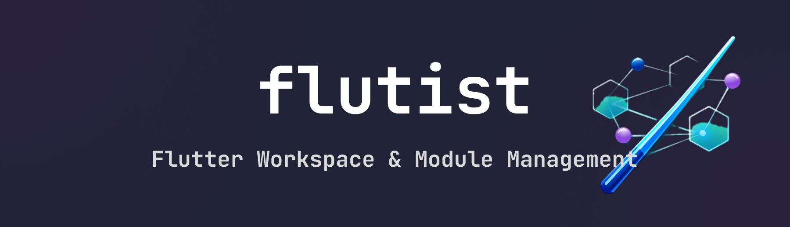

<div align="center">



**Manage your Flutter modular structure simply and systematically**

[](https://flutist-web.vercel.app/docs)
[](https://pub.dev/packages/flutist)
[](https://dart.dev)

</div>


## About

Flutist is a powerful project management framework for Flutter applications, inspired by [Tuist](https://tuist.io) for iOS development. It provides a structured approach to managing large-scale Flutter projects with modular architecture, centralized dependency management, and code generation capabilities.

Learn more about [**Flutist**](https://flutist-web.vercel.app/)!

### Core Values


|                   |                                                                    |
| ----------------- | ------------------------------------------------------------------ |
| **Declarative**   | Declare your entire project structure with a single `project.dart` |
| **Single Source** | All dependency versions managed in one place via `package.dart`    |
| **Rules as Code** | Architecture violations immediately halt generation                |


## Installation

```bash
dart pub global activate flutist
```

**Prerequisites:** Flutter SDK, `~/.pub-cache/bin` in PATH

## Quick Start

### 1. Initialize a Project

```bash
cd my_flutter_project
flutist init
```

Flutist adapts based on context:

- **No `pubspec.yaml`**: Asks if you want to create a new Flutter project. If yes, runs `flutter create .` and sets up as a new project automatically. If no, exits with guidance.
- `**pubspec.yaml` exists**: Asks whether this is a **new project** or an **existing project migration**.
  - **New project**: Creates `app` module, adds it to workspace, scaffolds `lib/main.dart`
  - **Existing project**: Only creates configuration files (`project.dart`, `package.dart`) and workspace setup — preserves your existing code, `analysis_options.yaml`, and `lib/main.dart`

### 2. Create a Module

```bash
# Create a clean module (Clean Architecture)
flutist create --name login --path features --options clean

# Create a micro module (Microfeature Architecture)
flutist create --name network --path packages --options micro

# Create a lite module (Microfeature lite)
flutist create --name auth --path packages --options lite

# Create a single package (omit --options)
flutist create --name utils --path core
```

Layer packages and their dependencies are **automatically wired** in `project.dart` when you run `flutist create`.

### 3. Manage Dependencies

```bash
# Add packages to package.dart with auto-resolved versions
flutist pub add http bloc flutter_bloc

# Sync dependencies to all modules
flutist generate
```

### 4. Generate Code from Custom Templates

```bash
# List available templates
flutist scaffold list

# Generate from a template
flutist scaffold feature --name login
flutist scaffold feature --name login --path lib/features
```

Templates live in `flutist/templates/`. Define your own templates to match your project conventions — just like Tuist.

## Commands


| Command | Description | Usage |
|---------|-------------|-------|
| **`init`** | Initialize a new or existing project | `flutist init` |
| **`create`** | Create a new module | `flutist create --name <name> --path <path> [--options <type>]` |
| **`generate`** | Sync dependencies and regenerate files | `flutist generate` |
| **`check`** | Check architecture rules (CI-friendly, no file changes) | `flutist check` |
| **`test`** | Run tests for all modules in parallel (auto-selects `flutter test` or `dart test`) | `flutist test [-m <module>]` |
| **`scaffold`** | Generate code from templates | `flutist scaffold <template> --name <name>` |
| **`pub`** | Manage dependencies | `flutist pub add <package>` |
| **`graph`** | Visualize module dependencies | `flutist graph [--format <format>]` |
| **`help`** | Show help information | `flutist help [command]` |


> **Note:** `flutist generate` manages dependencies declared in `package.dart` and `project.dart`. SDK dependencies (`flutter_localizations`, etc.) and Flutter-specific settings (`flutter: generate: true`, `flutter: uses-material-design: true`) should be added directly to each module's `pubspec.yaml` — they are preserved during generation.

## Core Files

`**package.dart`** — Single source of truth for external package versions and module names. Multiline format is required for parsing.

`**project.dart**` — Declares module dependencies and inter-module relationships. Read by `flutist generate`.

`**flutist_gen.dart**` — Auto-generated type-safe accessors. Never edit manually. Provides `package.dependencies.xxx` and `package.modules.xxx` for IDE autocomplete across all modules.

## Project Structure

A typical Flutist project structure:

```
my_project/
├── project.dart              # Project configuration
├── package.dart              # Centralized dependencies
├── pubspec.yaml              # Workspace configuration
├── lib/                      # Root application code
│   └── main.dart
├── app/                      # Main application module
│   ├── lib/
│   │   └── app.dart
│   └── pubspec.yaml
├── features/                 # Feature modules
│   └── auth/
│       ├── auth_domain/
│       ├── auth_data/
│       └── auth_presentation/
├── packages/                 # Library modules
│   └── network/
│       ├── network_interface/
│       ├── network_implementation/
│       ├── network_testing/
│       ├── network_tests/
│       └── network_example/
└── flutist/
    ├── templates/            # Scaffold templates
    └── flutist_gen.dart      # Generated code (never edit manually)
```

## Scaffold Types

`flutist create` generates layer packages and **automatically wires their dependencies** in `project.dart`.

### Clean (`--options clean`)

3-layer Clean Architecture. Best for feature modules with clear separation of concerns.

```
flutist create --name login --path features --options clean

features/login/
├── login_domain/          # Business rules, entities, use cases (no external deps)
├── login_data/            # Repositories, data sources, DTOs
└── login_presentation/    # UI and state management
```

**Auto-wired:** `presentation → domain`, `data → domain`

**Rule:** All dependency arrows point toward `domain`. Domain depends on nothing.

### Micro (`--options micro`)

5-layer Microfeature Architecture. Best for reusable libraries shared across features.

```
flutist create --name network --path packages --options micro

packages/network/
├── network_interface/         # Public API (abstract classes, models)
├── network_implementation/    # Concrete implementations
├── network_testing/           # Test helpers, mocks, fakes
├── network_tests/             # Unit and integration tests
└── network_example/           # Demo app for the module
```

**Auto-wired:** `implementation/testing → interface`, `tests/example → implementation + testing`

**Rule:** Consumers depend only on `interface`. Composition roots inject implementations.

### Lite (`--options lite`)

4-layer Microfeature lite (no example). Best for internal APIs.

```
flutist create --name auth --path packages --options lite

packages/auth/
├── auth_interface/
├── auth_implementation/
├── auth_testing/
└── auth_tests/
```

**Auto-wired:** `implementation/testing → interface`, `tests → implementation + testing`

### Single package (omit `--options`)

No layers. Best for utilities, shared models, or the app shell.

```
flutist create --name utils --path core

core/utils/
├── lib/
│   └── utils.dart
└── pubspec.yaml
```

## Architecture Validation

`flutist generate` and `flutist check` enforce the following rules automatically:

1. **Implementation References** — Only composition roots (default: `app`) and same-feature tests/examples may reference `_implementation` packages.
2. **Testing Layer Isolation** — `_testing` packages are excluded from production dependencies.
3. **Example Independence** — `_example` modules cannot be referenced by any production code.
4. **Direction Enforcement** — Same-feature layers follow the declared dependency direction (e.g., `presentation → domain`).
5. **Circular Dependencies** — Detected via DFS traversal; never permitted.

### Configuration

```dart
// project.dart
ProjectOptions(
  strictMode: true,              // true (default): halt on violation / false: warn only
  compositionRoots: ['app'],     // modules allowed to reference _implementation
)
```

- `**strictMode: true**` (default) — Violations halt `generate`/`check` immediately (exit 1).
- `**strictMode: false**` — Violations are printed but execution continues. Useful during migration.

## Scaffold Templates

Scaffold lets you define reusable code generation templates for your project — like Tuist scaffold.

`flutist init` creates a starter template at `flutist/templates/feature/`. From there, **you own the templates** — edit them freely to match your project conventions.

```
flutist/templates/
└── feature/                    # Template name (used in CLI)
    ├── template.yaml           # Declares attributes and what files to generate
    └── widget.dart.template    # Template file — use {{variables}} for substitution
```

### template.yaml

```yaml
description: "My custom template"

# Variables passed from the CLI (e.g. --name login --path lib/features).
# required: true  → must be provided via CLI, or an error is shown
# required: false → optional; uses `default` if not provided
attributes:
  - name: name
    required: true
  - name: path
    required: false
    default: "lib/features"
  - name: withTest
    required: false
    default: "false"

# Files to generate.
# type: file   — reads a .template file, applies variable substitution
# type: string — writes inline content directly (no .template file needed)
# if: "key == 'value'" — skip this item unless the condition is true
items:
  - type: file
    path: "{{path}}/{{name | snake_case}}_page.dart"
    templatePath: "page.dart.template"

  - type: string
    path: "{{path}}/{{name | snake_case}}/README.md"
    contents: |
      # {{name | pascal_case}}
      Auto-generated page.

  - type: file
    path: "{{path}}/{{name | snake_case}}_test.dart"
    templatePath: "test.dart.template"
    if: "withTest == 'true'"
```

The `if:` field supports `==`, `!=`, `&&`, and `||`:

```yaml
if: "withTest == 'true'"
if: "withTest != 'false'"
if: "withTest == 'true' && withMock == 'true'"
if: "style == 'bloc' || style == 'cubit'"
```

### Template variables

Use `{{variables}}` inside `.template` files and in `path` values:


| Syntax                   | Input `user profile` → Output |
| ------------------------ | ----------------------------- |
| `{{name}}`               | `user_profile`                |
| `{{name | pascal_case}}` | `UserProfile`                 |
| `{{name | camel_case}}`  | `userProfile`                 |
| `{{name | upper_case}}`  | `USER_PROFILE`                |
| `{{path}}`               | value of the `path` attribute |
| `{{withTest}}`           | value of any custom attribute |


### Example `.template` file

```dart
// page.dart.template
import 'package:flutter/material.dart';

class {{name | pascal_case}}Page extends StatelessWidget {
  const {{name | pascal_case}}Page({super.key});

  @override
  Widget build(BuildContext context) {
    return const Scaffold();
  }
}
```

### Running scaffold

```bash
# Basic usage (uses default path from template.yaml)
flutist scaffold feature --name login

# Override path
flutist scaffold feature --name login --path lib/features

# Pass a custom attribute defined in template.yaml
flutist scaffold page --name home --withTest true
```

Custom attributes defined in `template.yaml` are automatically available as `--<attribute>` CLI flags.

## Examples

### Clean Architecture Example

A complete Flutter project demonstrating Clean Architecture principles using Flutist:

**[flutist_clean_architecture](https://github.com/seonwooke/flutist_clean_architecture)**

- Clean Architecture with Domain, Data, and Presentation layers
- Centralized dependency management
- Best practices for large-scale Flutter applications

### Microfeature Architecture Example

A complete Flutter project demonstrating Microfeature Architecture principles using Flutist:

**[flutist_microfeature_architecture](https://github.com/seonwooke/flutist_microfeature_architecture)**

- Microfeature Architecture with Interface, Implementation, Tests, and Testing layers
- Reusable library modules with full isolation
- Centralized dependency management

## Contributing

Contributions are welcome! Please feel free to submit a Pull Request.

For development setup and guidelines, see the [documentation site](https://deepwiki.com/seonwooke/flutist).

## License

This project is licensed under the MIT License.

## Resources

- [Flutter Documentation](https://flutter.dev/docs)
- [Dart Documentation](https://dart.dev/guides)
- [Tuist (Inspiration)](https://tuist.io)

---

**Built with ❤️ for the Flutter community**